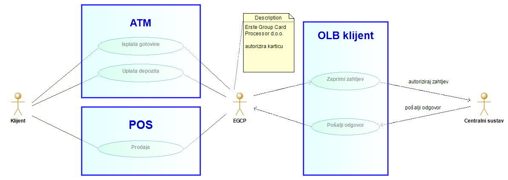
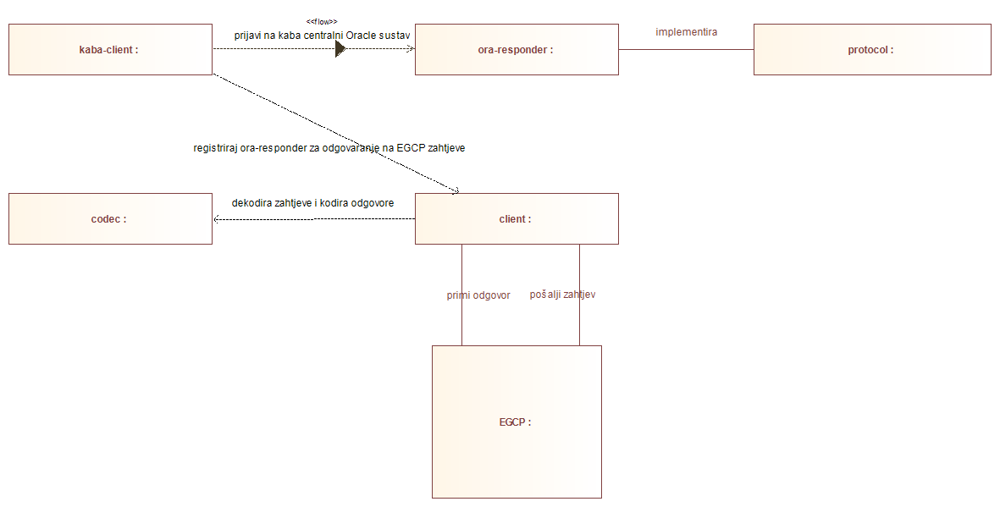

OLB - On Line to Bank
=====================

## Uvod 

On line do Banke (OLB) je usluga EGCP-a (Erste Group Card Processor d.o.o.) koja omogućuje banci izdavatelju kartice uključenje u proces autoriziranja transakcijskog zahtjeva. 
Radi se o autorizacijskom sustavu uspostavljenom na Base24 aplikacijskom rješenju.

OLB klijent je bančina implementacija OLB usluge, kojom se povezuje EGCP autorizacijski sustav i centralni bančin sustav
, čime se omogućuje on line autorizacija i knjiženje transakcija. 
On line sa stanovišta klijenta znači autorizaciju na osnovu stvarnog stanja na računu,
 čime se izjednačavaju transakcije na POS-evima i bankomatima (ATM) sa šalterskim i transakcijama rađenim na e-kabi i m-kabi.




OLB klijent je implementiran prema [specifikaciji](DOCS/Ko-055 170102 170926 Online do banke - opis usluge v17 01 02.pdf) EGCP-a


## Implementacija

OLB klijent je implementiran u javi kao niz povezanih [**maven**](https://maven.apache.org/) modula, te zahtjeva minimalno 1.8 verziju [**java-e**](https://www.java.com/en/).

Sljedeći moduli sadrže glavnu funkcionalnost:  

* codec - dekodira EGCP poruke, kodira odgovore u formatu pogodnom za slanje mrežom
* protocol - definira ponašanje koje treba implementirati autorizacijski sustav
* client - mrežna aplikacija koja se spaja na EGCP sustav, a na koju se registrira sustav koji implementira protocol modul
* ora-responder - autorizacijski sustav implementiran da zadovoljava protocol modul, a zove procedure na oracle bazi
* kaba-client - koristi client modul, na način da na njega registrira ora-responder spojen na bazu karlovačke banke

Dolje je prikazana veza između komponenti: 




Osim ovih projekt sadrži i par pomoćnih modula:

* logger - sadrži implementaciju gelf loggera za loggiranje na graylog server
* common - sadrži zajedničke opće klase
* server - nije implementirano - trebalo bi sadržavati mrežnu aplikaciju koja bi *glumila* EGCP


## Build, configure and deploy kaba OLB client 

### Build kaba OLB klijenta 

Klijent se generira pozicioniranjem u direktorij *kaba-client* i izvođenjem maven naredbe:
```mvn clean package assembly:single```

Rezultat toga je *olb-kaba-client* poddirektorij u *target* direktoriju kaba-client modula.

Direktorij sadrži aplikaciju **olb-kaba-client.jar**, te dva pod direktorija:
* lib - dependency direktorij - svi jarovi o kojima ovisi aplikacija
* conf - direktorij sa konfiguracijskim datotekama za logiranje, spajanje na bazu i EGCP

### Konfiguracija kaba klijenta

Kaba klijent sadrži konfiguraciju za spajanje na EGCP, spajanje na bazu, te format i mjesto poruka za logiranje


**host.properties**

Sadrži ip adresu i port server na koji se klijent treba spojiti. 
Također definira vrijeme nakon kojeg će se klijent ponovno probati spojiti na server, u slučaj da konekcija ne uspije.

property | opis | primjer 
------------:|:------------ | :-----:
*host* | ip adresa (EGCP) servera na koji se klijent treba spojiti | 127.0.0.1 
*port* | port na koji se klijent spaja | 1005
*reconnectInterval* | nakon kojeg intervala će se klijent ponovno probati spojiti na server, ako spajanje ne uspije | 5
*reconnectUnit* | vezano za reconnectInterval - koje jedinice se koriste| SECONDS, HOURS... - dopuštene vrijednosti iz java enum TimeUnit  


**db.properties**

Sadrži konfiguraciju bazne konekcije za ora-responder modul.
ora-responder koristi [HikariCP](https://github.com/brettwooldridge/HikariCP) JDBC connection pool, pa se zapravo radi o konfiguraciji koja vrijedi za HikariCP.

property | opis | primjer 
------------:|:------------ | :-----:
*dataSourceClassName* | - | oracle.jdbc.pool.OracleDataSource 
*dataSource.user* | bazni user | repw
*dataSource.password* | lozinka za usera | lozinka
*dataSource.databaseName* | ime bazne instance| kaba14  
*dataSource.portNumber* | port bazne instance| 1521
*dataSource.serverName* | server bazne instance| kbko04.kb.local
*dataSource.driverType* | - | thin
*poolName* | ime db poola | Kaba_OLB
*connectionTestQuery* | query koji će se izvesti da se provjeri radi li konekcija  | select sysdate from dual
*maximumPoolSize* | koliko će pool maksimalno konekcija koristiti  | 2

 
**log4j2.xml**

[The Simple Logging Facade for Java](https://www.slf4j.org/) (SLF4J) služi kao fasada za razne druge logging framework-e.
Jedan od tih, koji koristi OLB projekt je [Apache Log4j 2](https://logging.apache.org/log4j/2.x/).
log4j2.xml je konfiguracija za logiranje bazirano na SLF4J uz implementaciju za Apache Log4j 2.  

  
### Deploy kaba klijenta na windows-ima

Poglavlje opisuje jedan od načina produkcijskog rada kaba OLB klijenta na windows operativnom sustavu.

Klijent se instalira kao windows servis koristeći [Apache Commons Procrun](https://commons.apache.org/proper/commons-daemon/procrun.html).
Primjer instalacijskih skripti se nalazi u [dokumentaciji projekta](DOCS/servis/).

1. nakon build-a kaba klijenta iz izvornog koda kako je opisano [build dijelu](#build-kaba-olb-klijenta), kopirati *olb-kaba-client.jar* zajedno sa *lib* i *conf* direktorijima na produkcijski server.
2. [editirati properties](#konfiguracija-kaba-klijenta) za klijenta za spajanje na produkcijsku bazu i na produkcijski EGCP server
3. konfigurirati log properties za log4j2, po potrebi stvoriti direktorij za datoteke za logove
4. editirati skripte za instalaciju java aplikacije kao servisa preko [procrun](DOCS/servis/)
5. instalirati windows servis
6. pokrenuti windows servis za početak rada aplikacije, odnosno stopirati za prekid
  
